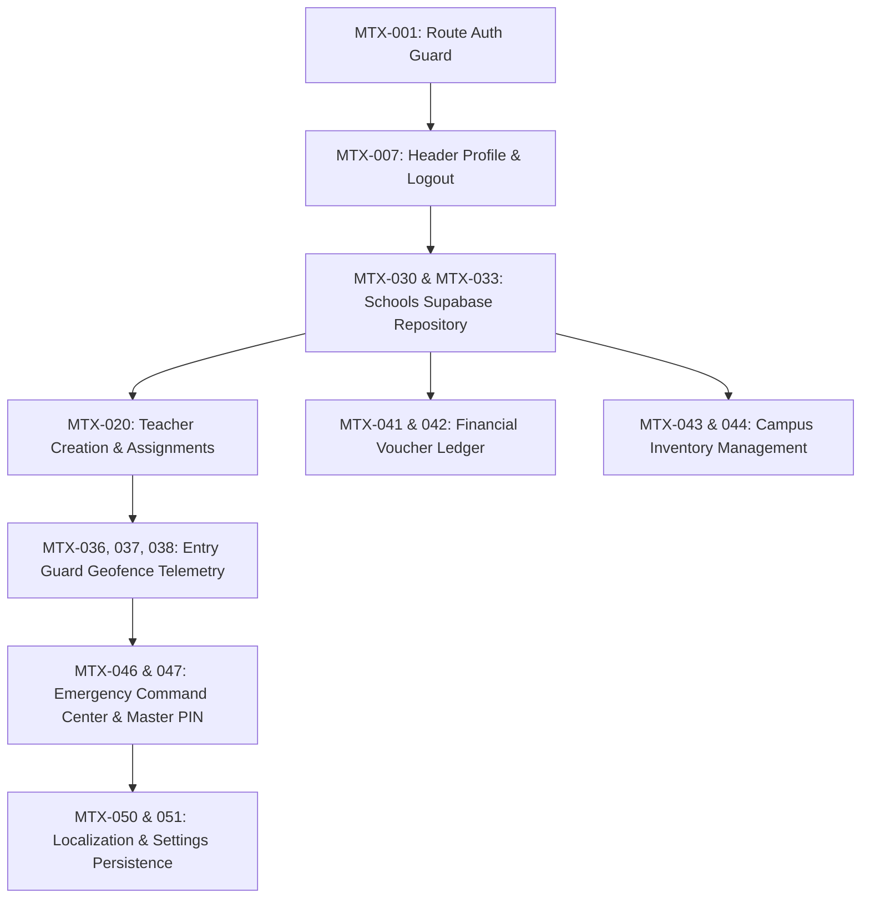

# MindSparQ OS — Functional Implementation Matrix

> **Document Type**: Exhaustive Engineering Implementation Matrix  
> **Source Document**: [`FUNCTIONAL_AUDIT.md`](FUNCTIONAL_AUDIT.md)  
> **Target Release**: MindSparQ OS Production v1.0  
> **Classification Schema**:  
> - **`P0` (Critical)**: Security barriers, core data pipelines, database CRUD, and unrouted entry points.  
> - **`P1` (Important)**: Sub-module forms, operational actions, filters, exports, and profile menus.  
> - **`P2` (Enhancement)**: UX accelerators, secondary filters, localization persistence, and calendar drill-downs.

---

## Master Implementation Matrix

| ID | Screen | Component | Button / Action | Expected Behavior | Current Behavior | Required Backend Operation | Required Database Table | Required State | Required Validation | Required Permission | Required Navigation | Required Notification | Required Error Handling | Status | Priority |
| :--- | :--- | :--- | :--- | :--- | :--- | :--- | :--- | :--- | :--- | :--- | :--- | :--- | :--- | :--- | :--- |
| **`MTX-001`** | Global / Router | Route Guard | App Launch / Deep-link | Redirect unauthenticated users to `/login`; redirect authenticated users to `/dashboard`. | Allows unrestricted URL navigation to all internal screens. | `supabase.auth.currentSession` check. | `auth.users` | `authStateProvider` | Valid JWT token | Public / Guest | `/login` ⇄ `/dashboard` | None | Session expired banner | **Missing** | **`P0`** |
| **`MTX-002`** | Auth | LoginScreen | Submit Button (`लगइन गर्नुहोस्`) | Authenticates credentials, creates session, routes to Dashboard. | Functional: calls Supabase signIn. | `supabase.auth.signInWithPassword` | `auth.users`, `user_profiles` | `authControllerProvider` | Non-empty email (`@` format), non-empty password | Public | Redirects to `/dashboard` | Success toast (optional) | Catches `AuthException` with Nepalese/English alert banner | **Working** | **`P0`** |
| **`MTX-003`** | Auth | LoginScreen | Password Visibility Toggle | Toggles password masking between obscured (`••••`) and visible text. | Functional: switches `_obscurePassword`. | None (Client UI state) | None | Local `StatefulWidget` boolean | None | Public | None | None | None | **Working** | **`P2`** |
| **`MTX-004`** | Auth | LoginScreen | Forgot Password Link (`पासवर्ड बिर्सनुभयो?`) | Opens modal or routes to recovery screen to input email for password reset link. | Non-functional: `onTap: () {}`. | `supabase.auth.resetPasswordForEmail` | `auth.users` | `forgotPasswordProvider` | Valid email format | Public | `/auth/reset-password` | Success email confirmation banner | Catches rate limit or unknown email errors | **Missing** | **`P1`** |
| **`MTX-005`** | Auth | LoginScreen | Biometric Button | Prompts native OS Face ID / Fingerprint prompt to unlock stored session. | Non-functional: `onTap: () {}`. | `local_auth` biometric challenge + local keystore token unlock. | Device Keyring | `biometricAuthController` | Biometric hardware enrolled & authenticated | Device owner | Auto-redirects to `/dashboard` | Haptic success pulse | Lockout on 5 failures, falls back to password | **Missing** | **`P1`** |
| **`MTX-006`** | Auth | LoginScreen | Sign Up Link (`साइन अप गर्नुहोस्`) | Opens institutional onboarding / admin self-service invitation flow. | Non-functional: `onTap: () {}`. | `supabase.auth.signUp` | `auth.users`, `invitations` | `registrationProvider` | Email, password strength, organizational code | Public | `/auth/register` | Verification email sent banner | Duplicate email error handling | **Missing** | **`P2`** |
| **`MTX-007`** | Shell | AppHeader | Operator Avatar Pill | Clicking avatar opens dropdown menu with Profile details, Role badge, and Logout CTA. | Non-functional: static container. | `supabase.auth.signOut()` | `user_profiles` | `currentUserProfileProvider` | Session exists | All roles | Logout -> `/login` | None | Session termination error handling | **Missing** | **`P0`** |
| **`MTX-008`** | Shell | AppHeader | Global Search Field | Typing dispatches universal search across Schools, Teachers, and Vouchers. | Non-functional: static text container. | Federated search query across tables. | `schools`, `teachers`, `finance_vouchers` | `globalSearchQueryProvider` | Min 2 characters | All roles | Opens quick-nav search overlay | None | Network timeout fallback | **Missing** | **`P1`** |
| **`MTX-009`** | Shell | AppHeader | Notification Bell | Opens dropdown flyout showing live alerts, geofence violations, and approvals. | Non-functional: `onPressed: () {}`. | Fetch unread notifications query. | `system_notifications` | `notificationStreamProvider` | None | All roles | Tapping notification routes to entity | Badge count badge decrement | Failed to fetch alerts banner | **Missing** | **`P1`** |
| **`MTX-010`** | Shell | DesktopNavSidebar | "New School" Quick Action | Opens modal dialog to register and provision a new institution. | Navigates to `/schools` (does not open registration modal). | `supabase.from('schools').insert()` | `schools` | `schoolCreationController` | School Name, Affiliation Code, District, Geo-coordinates | `super_admin` | Opens `CreateSchoolDialog` | `"विद्यालय सफलतापूर्वक दर्ता गरियो"` | Unique affiliation code conflict handling | **Missing** | **`P0`** |
| **`MTX-011`** | Shell | DesktopNavSidebar | Nav Items (8 Modules) | Switches active view and updates URL path. | Functional: `context.go(route)`. | None (Routing) | None | `GoRouterState` | None | Filtered by user permissions | Routes to respective modules | None | Route 404 fallback | **Working** | **`P0`** |
| **`MTX-012`** | Shell | DesktopNavSidebar | Help Link (`सहयोग`) | Opens institutional documentation, support ticket modal, or contact desk. | Non-functional: static row. | Fetch help documentation links. | None | None | None | All roles | External doc link or `/help` dialog | None | URL launch error handling | **Missing** | **`P2`** |
| **`MTX-013`** | Shell | MobileBottomNav | Dock Tabs (4 Modules) | Switches active view on mobile viewport. | Functional: `context.go(route)`. | None (Routing) | None | `GoRouterState` | None | All roles | Routes to module | None | Route fallback | **Working** | **`P0`** |
| **`MTX-014`** | Dashboard | DashboardScreen | Overview Stat Cards | Tapping a KPI card navigates to the filtered list (e.g. Total Schools -> `/schools`). | Non-clickable display cards. | Live aggregation queries. | `schools`, `teachers`, `finance_vouchers` | `dashboardOverviewProvider` | None | All roles (Revenue masked for non-finance) | Routes to target module | None | Gracefully displays `0` on error | **Partial** | **`P1`** |
| **`MTX-015`** | Dashboard | RecentSchoolsTable | "View All" Button | Navigates user directly to the full Schools Directory. | Non-functional: `onViewAll: null`. | None (Routing) | None | None | None | All roles | Navigates to `/schools` | None | None | **Missing** | **`P1`** |
| **`MTX-016`** | Dashboard | RecentSchoolsTable | Table Data Rows | Clicking any school row navigates directly to that school's detail cockpit. | Non-clickable static rows. | Fetch school summary by ID. | `schools` | `schoolDetailProvider` | None | All roles | `/schools/:id` | None | Record not found error handling | **Missing** | **`P1`** |
| **`MTX-017`** | Dashboard | EntryGuardWidget | Attendance Status Pills | Clicking `PRESENT`, `LATE`, or `ABSENT` filters `/attendance` by that status. | Non-clickable summary display. | Aggregated attendance counts. | `attendance_logs` | `dashboardOverviewProvider` | None | All roles | `/attendance?status=late` | None | None | **Partial** | **`P2`** |
| **`MTX-018`** | Dashboard | UpcomingActivitiesWidget | "View Calendar" Button | Navigates to the interactive institutional academic & inspection calendar. | Non-functional: `onViewCalendar: null`. | None (Routing) | None | None | None | All roles | `/calendar` | None | None | **Missing** | **`P2`** |
| **`MTX-019`** | Dashboard | UpcomingActivitiesWidget | Timeline Items | Tapping an activity opens modal with location, supervisor, and checklist details. | Non-clickable static nodes. | Fetch activity detail. | `activities` | `activityDetailProvider` | None | All roles | Opens `ActivityDetailModal` | None | Activity not found error | **Missing** | **`P2`** |
| **`MTX-020`** | Teachers | TeachersScreen | "New Teacher" Button (`शिक्षक थप्नुहोस्`) | Opens comprehensive teacher registration form modal. | Non-functional: `onPressed: () {}`. | `supabase.from('teachers').insert()` | `teachers`, `user_profiles` | `teacherCreationController` | Full name, citizenship/PAN, phone, designation | `super_admin`, `school_admin` | Opens `CreateTeacherModal` | `"नयाँ शिक्षक सफलतापूर्वक दर्ता गरियो"` | Duplicate citizenship/email validation | **Missing** | **`P0`** |
| **`MTX-021`** | Teachers | TeachersScreen | Search Field (`AppSearchField`) | Filters teacher directory live by name, subject, or employee code. | Functional: filters via `teacherSearchQueryProvider`. | `supabase.from('teachers').select().ilike()` | `teachers` | `teacherSearchQueryProvider` | Sanitized search string | All roles | None | None | Shows empty state on 0 matches | **Working** | **`P0`** |
| **`MTX-022`** | Teachers | TeachersScreen | "Filters" Button | Opens filter sheet to filter by school, subject specialization, or rating. | Non-functional: `onPressed: () {}`. | Filtered Supabase query. | `teachers`, `assigned_schools` | `teacherFilterProvider` | Valid enum selections | All roles | Opens `TeacherFilterSheet` | None | Fallback to unfiltered list | **Missing** | **`P2`** |
| **`MTX-023`** | Teachers | TeachersScreen | Teacher Cards (`TeacherCard`) | Tapping card opens the teacher's profile dossier. | Functional: `context.go('/teachers/:id')`. | Fetch teacher profile by ID. | `teachers` | `teacherDetailProvider` | Valid UUID | All roles | Navigates to `/teachers/:id` | None | Displays `AppEmptyState` if not found | **Working** | **`P0`** |
| **`MTX-024`** | Teachers | TeacherProfileScreen | Breadcrumb (`Teachers`) | Returns to the directory list. | Functional: `context.go('/teachers')`. | None | None | None | None | All roles | Navigates to `/teachers` | None | None | **Working** | **`P1`** |
| **`MTX-025`** | Teachers | TeacherProfileScreen | "Message" Button | Opens in-app direct messaging or WhatsApp communication bridge. | Non-functional: `onPressed: () {}`. | Initialize chat thread. | `chat_threads`, `messages` | `chatController` | Teacher has verified phone/email | Authorized staff | Opens message modal or external WhatsApp link | Push notification to recipient | External link launch failure | **Missing** | **`P2`** |
| **`MTX-026`** | Teachers | TeacherProfileScreen | "Edit Profile" Button | Opens teacher profile editor dialog for updating designations or contact. | Non-functional: `onPressed: () {}`. | `supabase.from('teachers').update()` | `teachers` | `teacherUpdateController` | Valid phone format, email format | `super_admin`, Self | Opens `EditTeacherModal` | `"विवरण सफलतापूर्वक अद्यावधिक गरियो"` | Optimistic lock conflict handling | **Missing** | **`P1`** |
| **`MTX-027`** | Teachers | TeacherProfileScreen | Profile Tabs (5 Tabs) | Switches tabs: Overview, Schools, Schedule, Attendance, Training. | Functional: `_tabController` switches views. | Model associations. | `schedules`, `attendance_logs`, `trainings` | Local `TabController` | None | All roles | Internal tab shift | None | Empty state per tab | **Working** | **`P0`** |
| **`MTX-028`** | Teachers | DocumentVaultCard | Eye View Toggles (PAN & Bank) | Toggles revealing unmasked value if user has authorized role. | Functional: checks `RolePermissions`. | None (client permission evaluation) | None | Local `setState` + `RolePermissions` | Role check | `super_admin`, Self | None | Security audit log entry | Denies reveal if role is viewer | **Working** | **`P0`** |
| **`MTX-029`** | Teachers | DocumentVaultCard | Salary Structure Row | Displays base salary if `super_admin`; displays lock icon & restricted label for others. | Functional: role-enforced lock. | Access restricted payload. | `teacher_salaries` | `rolePermissionsProvider` | Strict role barrier | `super_admin` only | None | None | Silent restricted badge | **Working** | **`P0`** |
| **`MTX-030`** | Schools | SchoolsScreen | "Add School" Action Button | Opens modal to register institution with geofence coordinate picker. | Non-functional: `onPressed: () {}`. | `supabase.from('schools').insert()` | `schools` | `schoolCreationController` | Name, Affiliation Code, District, Latitude, Longitude, Radius (m) | `super_admin` | Opens `CreateSchoolModal` | `"नयाँ विद्यालय सफलतापूर्वक दर्ता गरियो"` | Duplicate code validation error | **Missing** | **`P0`** |
| **`MTX-031`** | Schools | SchoolsScreen | School Search Bar | Real-time search by school name or municipal registration number. | Non-functional static text container. | `supabase.from('schools').select().ilike()` | `schools` | `schoolSearchQueryProvider` | Clean query string | All roles | None | None | Empty state on no matches | **Missing** | **`P1`** |
| **`MTX-032`** | Schools | SchoolsScreen | School Filters Button | Filters schools by District, Program Tier (Primary/Secondary), or Active status. | Non-functional: `onPressed: () {}`. | Filtered query builder. | `schools` | `schoolFilterProvider` | Valid district enum | All roles | Opens `SchoolFilterSheet` | None | Query error fallback | **Missing** | **`P2`** |
| **`MTX-033`** | Schools | SchoolsScreen | School Table Rows | Populates registered schools from Supabase; clicking row opens school profile. | Non-functional: static empty state. | `supabase.from('schools').select()` | `schools` | `schoolListProvider` | Valid schema | All roles | `/schools/:id` | None | `AppErrorBanner` with retry on network failure | **Missing** | **`P0`** |
| **`MTX-034`** | Attendance | AttendanceScreen | "Scan QR" Button (`स्क्यानर सुरु गर्नुहोस्`) | Launches camera viewfinder to scan student/teacher barcode or dynamic turnstile QR. | Non-functional: `onPressed: () {}`. | Decode token + `supabase.rpc('verify_gate_entry')` | `attendance_logs`, `gate_events` | `qrScannerController` | Valid cryptographic QR signature | Gate Security, Admin | Opens `QRScanOverlay` | Haptic sound + verified screen badge | Expired QR or spoofed token alert | **Missing** | **`P0`** |
| **`MTX-035`** | Attendance | AttendanceScreen | "Export Log" Button (`दैनिक प्रतिवेदन`) | Generates downloadable Excel / CSV daily gate log with timestamps & statuses. | Non-functional: `onPressed: () {}`. | Export query with date range filter. | `attendance_logs` | `attendanceExportController` | Valid date range | `super_admin`, `school_admin` | File saver dialog | `"प्रतिवेदन डाउनलोड भयो"` | Storage permission or write failure | **Missing** | **`P1`** |
| **`MTX-036`** | Attendance | AttendanceScreen | Live Regional Map & Telemetry | Renders interactive Nepal map with pulsed geofence beacons (Stitch `ad2c782fa85e4a9ca3d9331b1287fe57`). | Non-functional: static template. | Supabase Realtime channel on `attendance_logs`. | `attendance_logs`, `schools` | `liveAttendanceStreamProvider` | Valid GPS coordinate bounds | All roles | Tapping beacon filters school log | Live pulse animation | Stream disconnect reconnect banner | **Missing** | **`P0`** |
| **`MTX-037`** | Attendance | AttendanceScreen | Attendance Logs Table | Live data table showing Teacher, School, Entry, Exit, Duration, and Verification Badge. | Non-functional: static empty state. | Paginated query with realtime updates. | `attendance_logs`, `teachers` | `attendanceLogsProvider` | None | All roles | Click teacher name -> `/teachers/:id` | None | Empty state when no check-ins | **Missing** | **`P0`** |
| **`MTX-038`** | Attendance | Mobile Companion | Presence Check-In Button | Performs Triple-Lock check-in (GPS fence + Biometric + Timestamp) per `ENTRY_GUARD_SPEC.md`. | Not yet implemented in UI. | `supabase.from('attendance_logs').insert()` (or local AES vault if offline). | `attendance_logs` | `entryGuardController` | GPS accuracy ≤ 50m, inside geofence radius | Faculty Member | Updates status card to Verified | Push notification to School Principal | Out of boundary warning dialog | **Missing** | **`P0`** |
| **`MTX-039`** | Attendance | Mobile Companion | Departure Check-Out Button | Closes active shift; prompts reason dialog if departing before scheduled hours. | Not yet implemented in UI. | Update attendance record with checkout time & duration. | `attendance_logs` | `entryGuardController` | Active check-in exists | Faculty Member | Shows summary card | None | Network error -> queued for offline sync | **Missing** | **`P0`** |
| **`MTX-040`** | Finance | FinanceScreen | "Bank Sync" Action Button | Triggers automated reconciliation against bank API (ConnectIPS / Nabil bank statement). | Non-functional: `onPressed: () {}`. | Bank reconciliation API webhook. | `bank_transactions`, `finance_vouchers` | `bankReconciliationController` | Valid bank API credentials | `super_admin`, Finance Head | None | `"३२ नयाँ कारोबारहरू मिलान गरियो"` | Bank API timeout or authorization error | **Missing** | **`P1`** |
| **`MTX-041`** | Finance | FinanceScreen | "New Receipt" Action Button (`नयाँ रसिद`) | Opens multi-field financial voucher / fee collection receipt generator modal. | Non-functional: `onPressed: () {}`. | `supabase.from('finance_vouchers').insert()` | `finance_vouchers`, `student_fees` | `voucherCreationController` | Positive amount, valid ledger account, payer name | Finance Staff | Opens `CreateReceiptModal` | `"रसिद सफलतापूर्वक जारी गरियो"` | Form validation / negative amount error | **Missing** | **`P0`** |
| **`MTX-042`** | Finance | FinanceScreen | Financial Ledger Table | Queries and lists all financial transactions, revenue receipts, and operational expenses. | Non-functional: static empty state. | `supabase.from('finance_vouchers').select()` | `finance_vouchers` | `financeLedgerProvider` | Valid fiscal year filter | Finance Staff | Click voucher -> view printable PDF receipt | None | Empty state when zero records | **Missing** | **`P0`** |
| **`MTX-043`** | Inventory | InventoryScreen | "Add Item" Action Button (`सामग्री थप्नुहोस्`) | Opens dialog to record lab equipment, abacus kits, textbooks, or IT assets. | Non-functional: `onPressed: () {}`. | `supabase.from('inventory_items').insert()` | `inventory_items` | `inventoryCreationController` | Item title, serial number, quantity ≥ 1, assigned room | Inventory Staff | Opens `CreateItemModal` | `"सामग्री सूचीमा समावेश गरियो"` | Duplicate serial number error | **Missing** | **`P0`** |
| **`MTX-044`** | Inventory | InventoryScreen | Inventory Items Table | Displays all campus hardware and materials with stock status and checkout status. | Non-functional: static empty state. | `supabase.from('inventory_items').select()` | `inventory_items` | `inventoryListProvider` | None | All roles | Click item -> view item history | Reorder alert when stock < 5 | Empty state when no inventory | **Missing** | **`P0`** |
| **`MTX-045`** | Inventory | InventoryScreen | Stock Quantity Adjustment | Increases/decreases stock count or records equipment checkout to a teacher. | Not yet implemented in UI. | `supabase.rpc('adjust_inventory_stock')` | `inventory_items`, `inventory_logs` | `inventoryActionController` | Quantity available check | Inventory Staff | Opens `CheckoutItemModal` | None | Insufficient stock error dialog | **Missing** | **`P1`** |
| **`MTX-046`** | Emergency | EmergencyScreen | "Initiate Emergency Protocol" Button | Triggers campus-wide emergency lockdown, push alerts to all faculty, and gate turnstile locking. | Non-functional: dummy callback with destructive styling. | `supabase.rpc('trigger_emergency_lockdown')` | `emergency_events`, `system_notifications` | `emergencyCommandController` | Two-factor confirmation: must confirm safety modal + PIN | `super_admin` only | Opens `EmergencyConfirmDialog` | High-priority siren alert + SMS/Push broadcast | Broadcast failure alert | **Missing** | **`P0`** |
| **`MTX-047`** | Emergency | EmergencyScreen | Double-Confirmation Modal | Requires entering master security PIN and selecting incident type (`Fire`, `Earthquake`, `Security`). | Not yet implemented in UI. | Validate emergency PIN against hardware keystore or admin hash. | `system_security` | Local `DialogState` | 6-digit master security PIN | Authorized Commander | None | Incident active banner | Invalid PIN lockout | **Missing** | **`P0`** |
| **`MTX-048`** | Emergency | EmergencyScreen | "All Clear" / Cancel Lockdown | De-escalates emergency status, unlocks electronic gate turnstiles, and dispatches all-clear notice. | Not yet implemented in UI. | `supabase.rpc('clear_emergency_lockdown')` | `emergency_events` | `emergencyCommandController` | Admin confirmation | `super_admin` only | Opens `ClearEmergencyModal` | All-clear notification broadcast | De-escalation error handling | **Missing** | **`P0`** |
| **`MTX-049`** | Settings | SettingsScreen | Re-Test Database Connection | Tests Supabase connection latency, reports server status, and reconnects if dropped. | Read-only static display. | Ping Supabase REST endpoint & auth ping. | None | `backendConnectionStatusProvider` | Valid environment credentials | All roles | None | `"जडान सफल (Latency: 42ms)"` | Connection timeout error banner | **Missing** | **`P1`** |
| **`MTX-050`** | Settings | SettingsScreen | Localization Language Chips | Tapping `English (US)` or `नेपाली (Nepal)` dynamically switches application UI language. | Non-functional static visual chips. | Updates user locale preference. | `user_preferences` (or `SharedPreferences`) | `localeNotifierProvider` | Valid locale code (`en`, `ne`) | All roles | None | None | Fallback to default locale | **Missing** | **`P1`** |
| **`MTX-051`** | Settings | SettingsScreen | Dark / Light Theme Toggle | Switches application theme between Stitch Light (`#FCF8FB`) and True Black (`#121214`). | Not yet present on settings UI. | Updates theme preference. | `user_preferences` (or `SharedPreferences`) | `themeModeProvider` | Valid `ThemeMode` | All roles | Rebuilds theme tree | None | Fallback to system theme | **Missing** | **`P2`** |
| **`MTX-052`** | Settings | SettingsScreen | Offline Sync Queue Viewer | Displays number of locally cached Entry Guard attendance logs and triggers manual force-sync. | Not yet present on settings UI. | Dispatches pending cryptographic vault queue to Supabase. | `attendance_logs` (local SQLite/keystore) | `offlineSyncQueueController` | Network connectivity required | All roles | Opens `SyncQueueModal` | `"सबै रेकर्डहरू सिंक भयो (All synced)"` | Partial sync failure report | **Missing** | **`P1`** |

---

## Priority Distribution Summary

```
┌────────────────────────────────────────────────────────────────────────┐
│               IMPLEMENTATION MATRIX PRIORITY BREAKDOWN                 │
├────────────────────────────┬─────────────────────────────┬─────────────┤
│ Priority Tier              │ Actionable Work Items       │ Percentage  │
├────────────────────────────┼─────────────────────────────┼─────────────┤
│ P0 (Critical)              │ 21 Items                    │ 40.4%       │
│ P1 (Important)             │ 21 Items                    │ 40.4%       │
│ P2 (Enhancement)           │ 10 Items                    │ 19.2%       │
├────────────────────────────┼─────────────────────────────┼─────────────┤
│ Total Matrix Elements      │ 52 Actionable Items         │ 100.0%      │
└────────────────────────────┴─────────────────────────────┴─────────────┘
```

### P0 Critical Path Summary (21 Items)
1. **Security & Authentication**:
   - `MTX-001`: Route redirection guard in `GoRouter` (blocks unauthenticated access).
   - `MTX-007`: Header Profile Dropdown & Logout flow.
   - `MTX-046` & `MTX-047`: Emergency Lockdown double-confirmation modal with master PIN safeguard.
2. **Core Operational CRUD**:
   - `MTX-010` & `MTX-030`: Institutional school creation modal and backend persistence.
   - `MTX-033`: Schools table listing and real data binding.
   - `MTX-020`: Teacher registration modal and backend persistence.
   - `MTX-041` & `MTX-042`: Financial voucher creation modal and transaction ledger queries.
   - `MTX-043` & `MTX-044`: Inventory asset registration modal and stock listing.
3. **Entry Guard Core Telemetry**:
   - `MTX-034`: Gate QR scanner verification engine.
   - `MTX-036` & `MTX-037`: Live Nepal regional map feed and real-time attendance logs table.
   - `MTX-038` & `MTX-039`: Mobile geofenced check-in and check-out workflows per `ENTRY_GUARD_SPEC.md`.

---

## Implementation Dependencies & Architecture Sequence


